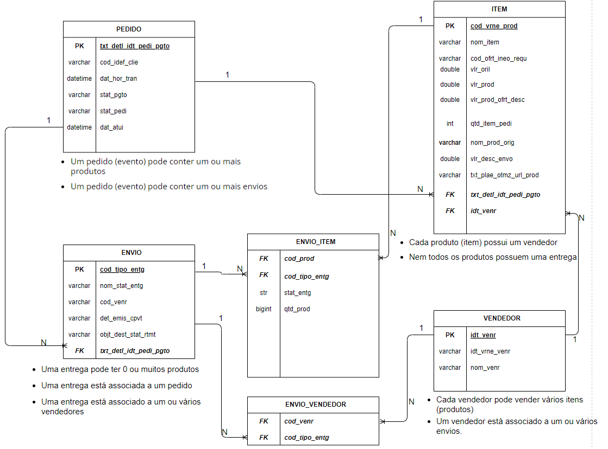

# Case Técnico - Pedidos

O caso de uso envolve a ingestão de eventos relacionados a pedidos. A cada atualização do pedido um novo evento é gerado no formato JSON, comforme exemplificado abaixo: 

```json
{
  "txt_detl_idt_pedi_pgto": "SMT1113589577463",
  "cod_idef_clie": "TESTE",
  "dat_hor_tran": "2023-05-11T13:58:33.181Z",
  "list_item_pedi": [{
      "nom_item": "TESTE",
      "cod_ofrt_ineo_requ": "64555c61d3a78500119f6518",
      "vlr_oril": 106.5,
      "vlr_prod": 59.9,
      "vlr_prod_ofrt_desc": 0.0,
      "qtd_item_pedi": 1,
      "idt_venr": "8dJAULm6us",
      "nom_venr": "TESTE",
      "idt_vrne_venr": "4646195",
      "cod_vrne_prod": "MKU-9iSYhmyGMPHpM"
    },
    {
      "nom_item": "TESTE",
      "cod_ofrt_ineo_requ": "626c239951dd578ff254c226",
      "vlr_oril": 69.9,
      "vlr_prod": 44.5,
      "vlr_prod_ofrt_desc": 0.0,
      "qtd_item_pedi": 1,
      "idt_venr": "hxL9bHz7OO",
      "nom_venr": "TESTE",
      "idt_vrne_venr": "222419500_TESTE",
      "cod_vrne_prod": "MKU-tkv6tbv5AAquh"
    }
  ],
  "list_envo": [{
    "cod_tipo_entg": "PF1c599LF_Zm3",
    "list_item_envo": [{
      "qtd_prod": 1,
      "cod_prod_venr": "4646195",
      "cod_prod": "MKU-9iSYhmyGMPHpM",
      "stat_entg": "BILLED"
    }],
    "cod_venr": "8dJAULm6us",
    "nom_stat_entg": "BILLED"
  }],
  "stat_pgto": "PAID",
  "stat_pedi": "PARTIALLY-BILLED",
  "dat_atui": "2023-05-11T18:04:53.541Z"


``` 

Com base neste cenário uma série de requisitos precisam ser respeitados. Em seguida encontram-se os requisitos solicitados e a linha de racícionio utilizada para atendê-los, assim como o desenvolvimento.

### Requisitos

- **Analise a estrutura do evento e realize a modelagem física dos dados de forma que facilite seu consumo por parte dos usuários finais (analistas de negócios e de dados).**  
   
  R:  Desenvolvido um Diagrama Entidade Relacionamento (ER) com base na estrutura dos dados. O objetivo do diagrama foi demonstrar como os dados estão estratificados em entidades e  relacionados entre si, objetivando o fácil entendimento para os usuários finais. 
  Em seguida encontra-se o dicionário de dados de cada entidade. 

  

  **Dicionário de Dados**
    - [PEDIDO](#pedido)  
    - [ITEM](#item)
    - [VENDEDOR](#vendedor)
    - [ENVIO](#envio)
    - [ENVIO_ITEM](#envio_item)
    - [ENVIO_VENDEDOR](#envio_vendedor)

  **<a id="pedido"></a>Entidade: PEDIDO**

  | Nome do Campo  | Tipo de Dados  | Descrição  |
  |---|---|---|
  | txt_detl_idt_pedi_pgto  | varchar  | O id do pedido pai que gerou o pedido atual.|
  | cod_idef_clie  | varchar  | Identificador do cliente do pedido  |
  | dat_hor_tran  | datetime  | Data de criação do pedido  |
  | stat_pgto  | varchar  | Representação de uma situação(status) de pagamento pedido  |
  | stat_pedi  | varchar  | Representação do nome da situação(status) do pedido |
  | dat_atui  | datetime  | Data da última atualização do pedido  |  
   

  **<a id="item"></a>Entidade: ITEM**

  | Nome do Campo  | Tipo de Dados  | Descrição  |
  |---|---|---|
  | cod_vrne_prod  | varchar  | Identificação da variante do produto  |
  | nom_item  | varchar  | Nome do item do pedido |
  | cod_ofrt_ineo_requ  | varchar  | Identificação da oferta do pedido |
  | vlr_oril  | double  | Variante do produto Preço original com valor minimo maior ou igual a 0 |
  | vlr_prod  | double  | Preço variante do produto com valor minimo maior ou igual a 0 |
  | vlr_prod_ofrt_desc  | double  | Desconto da variante do produto com valor minimo maior ou igual a 0 e com padrão sendo 0 |
  | qtd_item_pedi  | int  | Quantidade de itens do pedido sendo no minimo 1 item por pedido |
  | nom_prod_orig  | varchar  | Não foi encontrado este campo no dicionário de dados  |
  | vlr_desc_envo  | double  | Não foi encontrado este campo no dicionário de dados   |
  | txt_plae_otmz_url_prod  | varchar   | Não foi encontrado este campo no dicionário de dados |
  | txt_detl_idt_pedi_pgto  | varchar  | Identificador do pedido associado ao item  |
  | idt_venr  |  varchar | Identificador do vendedor associado ao item  |

  **<a id="vendedor"></a>Entidade: VENDEDOR**
  
  | Nome do Campo  | Tipo de Dados  | Descrição  |
  |---|---|---|
  | idt_venr  | varchar  | Numero de Identificação do Vendedor |
  | idt_vrne_venr  | varchar  | Identificador do vendedor à variante do produto |
  | nom_venr  | varchar | Nome do vendedor |
  

  **<a id="envio"></a>Entidade: ENVIO**
  
  | Nome do Campo  | Tipo de Dados  | Descrição  |
  |---|---|---|
  | cod_tipo_entg   | varchar  | Código do tipo de entrega usado para envio de produtos |
  | nom_stat_entg  | varchar  | Descrição do Status da Entrega do produto para o cliente |
  | det_emis_cpvt  | varchar  | Não foi encontrado este campo no dicionário de dados |
  | objt_dest_start_rtmt  | varchar  | Não foi encontrado este campo no dicionário de dados |
  | txt_dtl_idt_pedi_pgto  | varchar  | Identificador do pedido associado ao envio  |

  **<a id="envio_item"></a>Entidade: ENVIO_ITEM**
  
  | Nome do Campo  | Tipo de Dados  | Descrição  |
  |---|---|---|
  | cod_prod  | varchar  | Identificador do item associado ao envio  |
  | cod_tipo_entg  |  varchar  | Identificador do envio associado ao item |
  | stats_entg  | varchar  | Texto que contém informações da movimentação da entrega do item |
  | qtd_prod  |  bigint  | A quantidade do item |


  **<a id="envio_vendedor"></a>Entidade: ENVIO_VENDEDOR**
  
  | Nome do Campo  | Tipo de Dados  | Descrição  |
  |---|---|---|
  | cod_venr  | varchar  | Identificador do vendedor associado ao envio  |
  | cod_tipo_entg  |  varchar  | Identificador do envio associado ao vendedor  |


- **Desenvolva um código que permita ler, transformar e carregar as informações utilizando Python/PySpark, garantindo que o código possa ser reaproveitado por outros eventos e que garanta:**
  - Modularização do código utilizando orientação a objetos, pensando em reaproveitamento de código;
  
     R: *Criado o arquivo **entities.py**. Neste arquivo contém todas as classes estruturadas a partir das definições e aninhamentos dos arquivos JSONs disponibilizados.*

  - Unicidade dos pedidos, tendo apenas a posição mais atual de um pedido de compra;  
  
    R: *Desenvolvido um método chamado de **verify_order_update**, dentro do arquivo main.py. Este arquivo analisa a data da ultima atualização do arquivo de entrada e a data de atualização do mesmo pedido no destino. Se houver uma atualização, então o arquivo é atualizado no destino, garantido unicidade*

  - Relacionamento entre os registros das tabelas modeladas;
  
    R: *Os dados do arquivo de entrada são reestruturados em objetos, cada qual representando uma entidade. Estes objetos são então agrupados entre si, conforme seu relacionamento. Exemplo: um objeto Shipping (envio) pode possuir uma lista de objetos enviados ShippingItems (envio_item)*

  - Incremento de carga de dados levando em consideração a possibilidade de haver atualização para eventos gravados na tabela final;
    
    R: *Vários eventos podem ser lidos simultaneamente, possibilidando atualização na tabela final. No caso deste caso de uso obtou-se por gravar o arquivo final json e não em um banco relacional.*

  - Dados sendo disponibilizados para consumo bem próximo ao tempo de criação, tendo no máximo uma latência de 15 minutos entre sua produção e disponibilização para consumo do usuário final.
  
    R: *Para geração das classes foi utilizado a configuração **slot** como verdadeira. Neste sentido, ao instanciar a classe todos os atributos são criados em um dicionário reduzido, respeitando o número de atributos pré-determinados para a classe. Assim, otimiza-se espaço e processamento. Outro ponto a ser ressaltado. Para fins lúdicos do caso de uso, optou-se por vasculhar todos os arquivo no "bucket_input" e não a leitura de apenas um arquivo. Nota-se, portanto, que em cenário produtivo seria a execução de um evento (arquivo json) por vez conforme o mesmo fosse inserido no S3.*

 **Instruções para execução do código:**  
  Para executar o código, basta ir para o diretóio da pasta *src/code* e executar o arquivo **main.py**. O código foi desenvolvido para ser genérico, permitindo alterar o diretório de entrada e saída dos arquivos.Os diretórios padrão visam simular um *bucket* no AWS S3. 

 ```code
   python main.py data/bucket_input data/bucket_output
 ```
  
